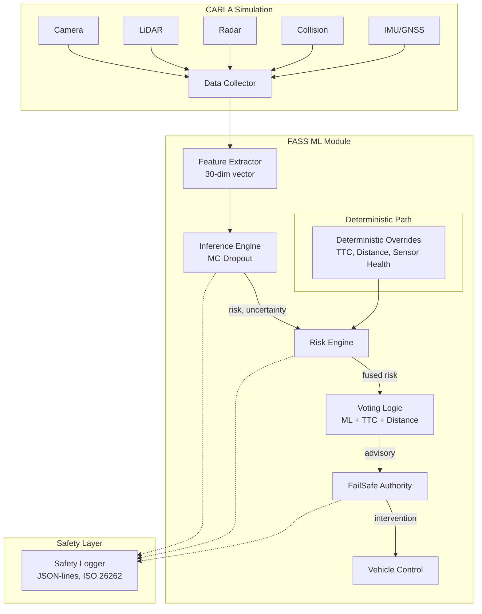

# FASS ML Module — Failure-Aware Safety Supervisor

> Machine-learning-based risk prediction with uncertainty estimation for
> autonomous driving supervision inside CARLA 0.9.15.

## Architecture



## Key Design Principles

### Safety-First ML
- **ML predictions are ADVISORY ONLY** — they never bypass deterministic thresholds
- Deterministic overrides (TTC < 1s, distance < 2m, sensor failure) **always take priority**
- The `max(ML_risk, deterministic_risk)` fusion ensures ML can only _increase_ safety sensitivity

### Uncertainty-Aware Predictions
- **MC-Dropout** (Monte Carlo Dropout): multiple forward passes with dropout enabled at inference
- **Epistemic uncertainty**: model uncertainty from variance across MC samples
- **Aleatoric uncertainty**: data noise predicted directly by the network (log-variance head)
- High uncertainty → conservative risk boost → earlier interventions

### ISO 26262 Alignment
- **ASIL-D voter pattern**: multi-channel voting with veto authority
- **Latching SAFE_STOP**: once triggered, cannot be cancelled by ML (operator-only reset)
- **Structured logging**: every prediction logged with scenario ID, timestamps, decomposed uncertainty
- **Deterministic self-test**: runs at startup to verify safety overrides

## Module Structure

```
fass_ml/
├── __init__.py
├── data/                    # Data pipeline
│   ├── carla_data_collector.py   # CARLA sensor hooks + frame recording
│   ├── feature_extractor.py      # 30-dim feature vector extraction
│   ├── dataset.py                # PyTorch dataset with risk-weighted sampling
│   └── scenario_generator.py     # Edge-case scenario spawner (9 categories)
├── models/                  # ML model
│   ├── risk_model.py             # FASSRiskNet (MLP + MC-Dropout)
│   └── losses.py                 # Heteroscedastic NLL + false-negative penalty
├── training/                # Training pipeline
│   ├── config.py                 # ALL hyperparameters, seeds, thresholds
│   ├── train.py                  # Training loop with early stopping
│   └── evaluate.py               # ECE, uncertainty decomposition, latency benchmarks
├── integration/             # FASS modules
│   ├── inference.py              # Production inference engine
│   ├── risk_engine.py            # ML + deterministic fusion
│   ├── voting_logic.py           # Multi-evaluator weighted voting
│   ├── failsafe_authority.py     # Intervention decisions
│   └── fass_supervisor.py        # Top-level orchestrator
├── safety/                  # Safety layer
│   ├── safety_logger.py          # Structured JSON-lines logging
│   └── deterministic_overrides.py # Physics-based hard thresholds
├── demo_carla_loop.py       # End-to-end demo (CARLA or synthetic)
└── README.md                # This file
```

## Quick Start

### 1. Train on Synthetic Data (no CARLA needed)

```bash
cd WindowsNoEditor/PythonAPI
python -m fass_ml.training.train --synthetic --epochs 20
```

### 2. Evaluate
```bash
python -m fass_ml.training.evaluate --synthetic --checkpoint ./fass_checkpoints/best_model.pt
```

### 3. Run Demo (synthetic mode)
```bash
python -m fass_ml.demo_carla_loop --synthetic --ticks 100
```

### 4. Run with CARLA Server
```bash
# Terminal 1: Start CARLA
./CarlaUE4.exe -windowed -quality-level=Low

# Terminal 2: Collect training data
python -m fass_ml.data.carla_data_collector --frames 1000 --out ./fass_data

# Terminal 3: Generate edge-case scenarios
python -m fass_ml.data.scenario_generator --scenarios 18 --out ./fass_data

# Terminal 4: Train on collected data
python -m fass_ml.training.train --data-dir ./fass_data --epochs 50

# Terminal 5: Run FASS demo
python -m fass_ml.demo_carla_loop --checkpoint ./fass_checkpoints/best_model.pt
```

## Configuration Reference

All parameters are in `training/config.py` (`FASSConfig` dataclass):

| Parameter | Default | Description |
|-----------|---------|-------------|
| `hidden_dims` | (128, 64, 32) | Network layer sizes |
| `dropout_p` | 0.15 | MC-Dropout probability |
| `mc_samples` | 30 | MC forward passes at inference |
| `safety_weight` | 3.0 | False-negative penalty multiplier |
| `ttc_emergency_s` | 1.0 | TTC → emergency brake (seconds) |
| `min_distance_stop_m` | 2.0 | Distance → emergency stop (meters) |
| `sensor_failure_threshold` | 2 | Sensor failures → safe stop |
| `max_inference_latency_ms` | 50.0 | Latency warning threshold |
| `global_seed` | 42 | Reproducibility seed |

## Safety Rationale: Why Deterministic Thresholds Override ML

ML models are powerful but **can fail silently**. A neural network might output `risk=0.1` while an object is 1 meter away. This is not a theoretical concern — adversarial examples, distribution shift, and sensor corruption can all cause this.

The deterministic safety path provides a **physics-based safety floor**:
- It has **zero dependency** on learned weights
- It uses **direct measurements** (distance, TTC, sensor count)
- It is **verifiable** through exhaustive testing (see `self_test()`)
- It is **compliant** with ISO 26262 ASIL-D requirements for independent safety mechanisms

The fusion rule `fused_risk = max(ML_risk, deterministic_risk)` guarantees that ML can **only increase sensitivity**, never decrease it below physics-based minimums.

## Evaluation Metrics

The `evaluate.py` module reports:
- **ECE** (Expected Calibration Error): how well predicted probabilities match actual risk frequency
- **Epistemic/Aleatoric decomposition**: model vs. data uncertainty, critical for identifying when to trust predictions
- **False-negative rate**: most critical safety metric — missed high-risk events
- **Latency** (p50/p95/p99): real-time compliance verification
- **Scenario coverage**: percentage of edge-case categories exercised in training data
